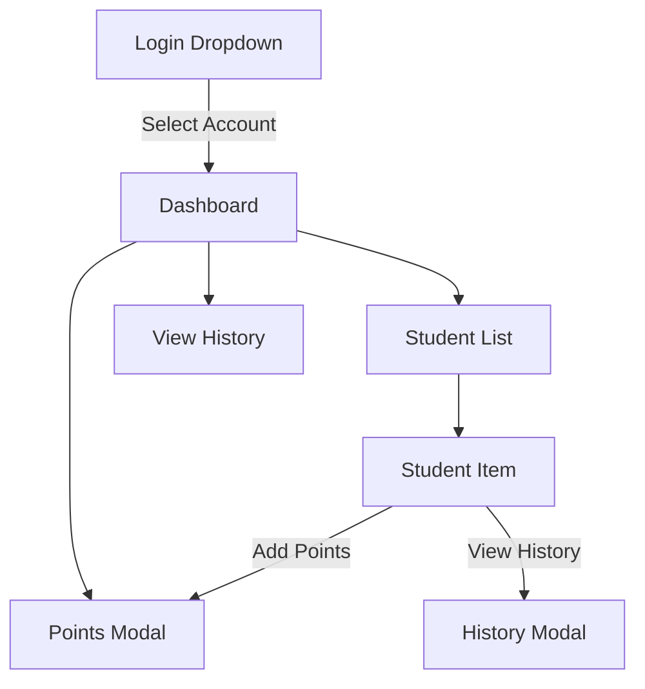
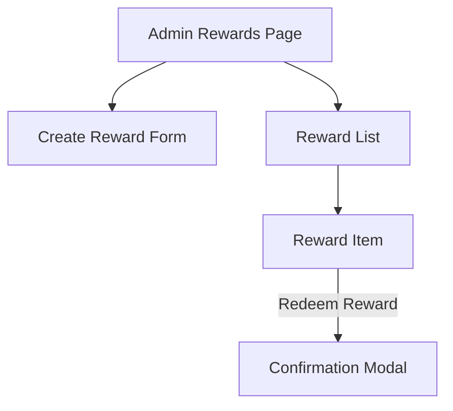

# Wireframes for Digital Wallet for Student Points MVP

## Login / Dashboard Wireframe

### Notes:
- The login dropdown allows users to select either a student or admin account.
- The dashboard displays a list of students with their points and actions to add points or view history.
- The Points Modal is used for adding points to a selected student.

## Admin Rewards Page Wireframe

### Notes:
- The Admin Rewards page allows admins to create new rewards and manage existing ones.
- The Create Reward Form includes fields for title, cost in points, and quantity.
- The Reward List displays all available rewards, with an option to redeem them.

### UX Decisions:
- The use of modals for adding points and confirming reward redemption keeps the interface clean and focused.
- Clear separation of student and admin functionalities ensures a straightforward user experience.

### Mapping to Task 4 UX/UI Requirement:
- The wireframes illustrate the core functionalities and user interactions within the application, adhering to the specified UX/UI requirements.